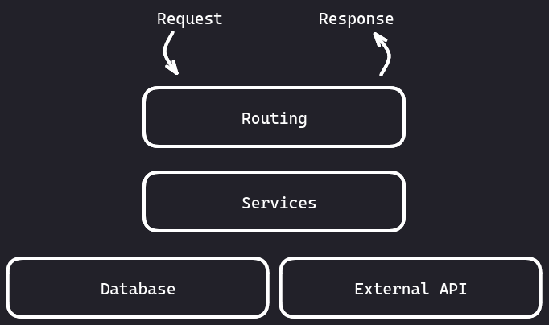
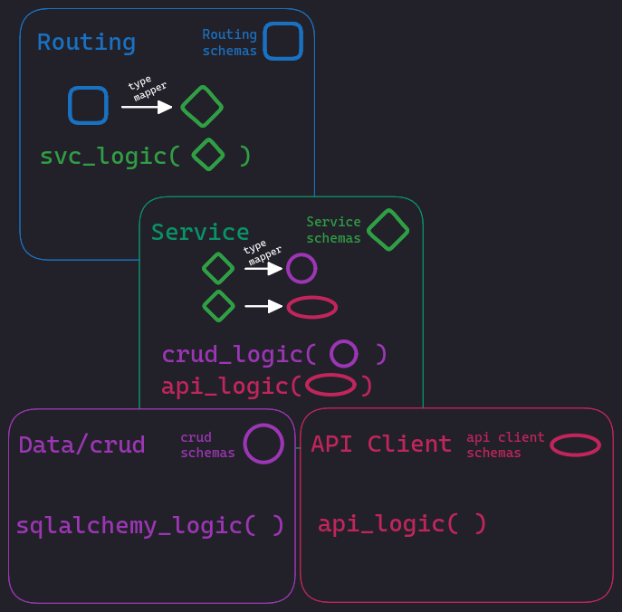

# Q:
How to organise data structures and logic of a REST API considering a layered architecture?

# A:

## How is the logic displaced across the various layers?

<!--  -->


### Routing

The routing layer serves as a bridge between the client making the request and the underlying functionality of the API. It is responsible for parsing the incoming requests, extracting relevant information such as the requested resource path, query parameters, and HTTP method (GET, POST, PUT, DELETE, etc.), and determining how to handle the request.

### Services

The services layer acts as a bridge between the routing layer and the underlying database or the API Client layers. Its primary purpose is to encapsulate the business logic and application-specific operations related to the API's resources.

### Database

It is responsible for storing, managing, and retrieving data from a database system.

### API Client

The layer comprised of API clients to interact with external REST APIs can be referred to as the "API Client Layer" or the "Integration Layer." It acts as an intermediary between your application and external services, allowing you to consume and interact with their RESTful APIs.

## Schemas

Each layer should have its own set of schemas and the client of a given layer should only use the logic of that layer in conjunction with its set of schemas and none else. For example, let's say `RouteA` depends on `ServiceA` to accomplish some task. In this scenario, `RouteA` has to map all required schemas at the routing layer onto schemas of the service layer before calling routines of `ServiceA`. The same would also apply if the service layer would use the data layer or an API Client.

<!--  -->


## Implementation

``` python
# app/user/schemas.py

class UserCreate(BaseModel):
    name: str
    height: int

class UserRead(BaseModel):
    id: uuid.UUID
    name: str
    height: int


class UserRouteCreate(UserCreate):
    ...

class UserRouteRead(UserRead):
    ...

class UserSvcCreate(UserCreate):
    ...

class UserSvcRead(UserRead):
    ...

```


``` python
# app/user/routes.py

from pydantic import parse_obj_as
from app.user.deps import get_user_service
from app.user.schemas import (
    UserRouteCreate,
    UserRouteRead,
    UserSvcCreate,
    UserSvcRead,
)
from app.user.service import UserService

@router.post("/users")
async def create_user(
    *,
    user_svc: UserService = Depends(get_user_service),
    user: UserRouteCreate,
) -> UserRouteRead:
    """Create new user."""

    user_svc_read: UserSvcRead = await user_svc.create_user(
        user=parse_obj_as(UserSvcCreate, user),
    )
    return parse_obj_as(UserRouteRead, user_svc_read)

```

``` python
# app/user/deps.py
from app.db.deps import get_db

async def get_user_service(
    db: AsyncSession = Depends(get_db),
) -> UserService:
    user_svc: UserService = await create_service(db=db)
    return user_svc


# app/user/services.py
class UserService(BaseService):
    def __init__(
        self,
        db: AsyncSession,
    ):
        super().__init__(db=db)

    async def create_user(
        self,
        user: UserSvcCreate,
    ) -> UserSvcRead:
        user_db: Optional[UserDb] = await crud_user.create(
            db=self.db,
            obj_in=parse_obj_as(UserSvcCreate, user),
        )
        user_svc_read = parse_obj_as(UserSvcRead, user_db)
        return user_svc_read


# Facade #############################
async def create_user_service(
    db: AsyncSession,
) -> UserService:
    user_svc: UserService = UserService(db=db)
    return user_svc
```

